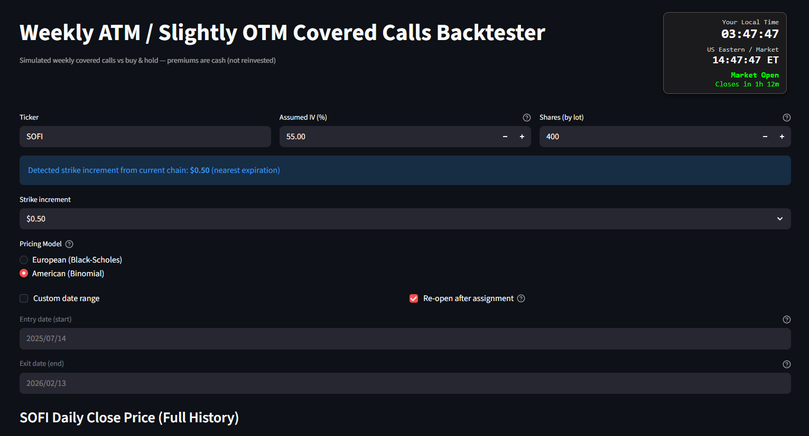
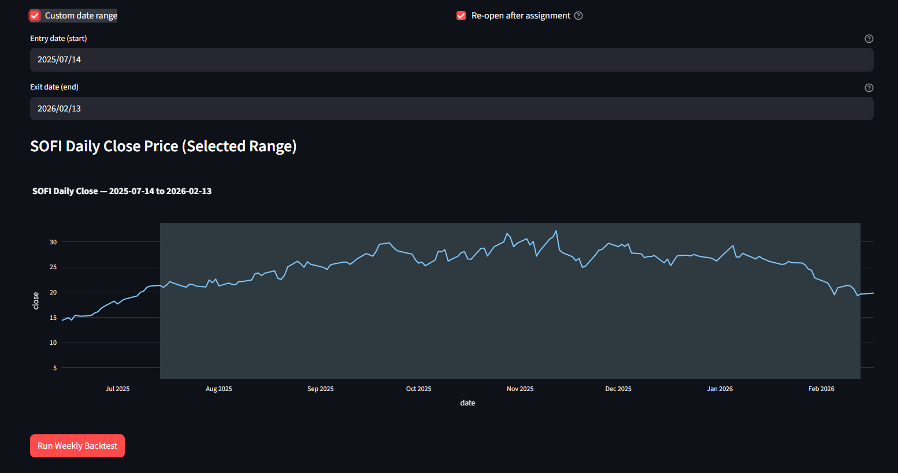
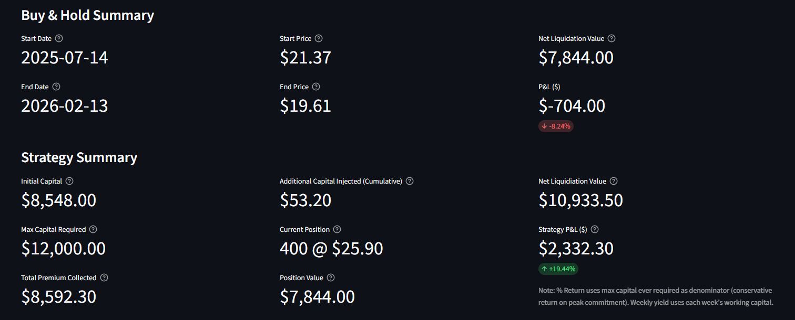
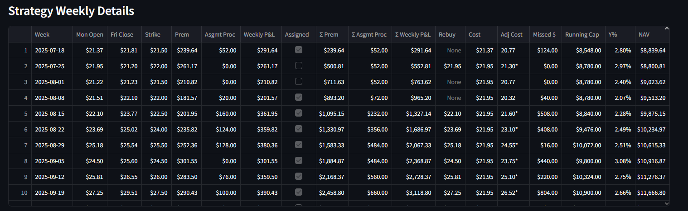
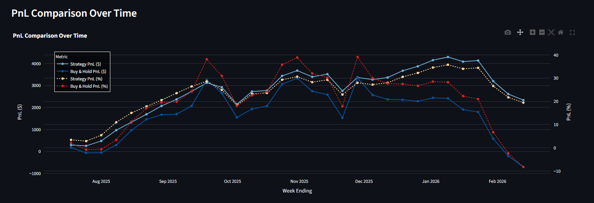

# Weekly Covered Call Backtester

Simulates weekly Friday-expiry ATM / slightly OTM covered calls (Monday → Friday) vs. buy-and-hold, estimated historical option prices using Binomial / Black-Scholes, assignment & rebuy logic, P&L comparison charts.

Live: https://weekly-covered-call-backtester.streamlit.app

  
*Backtest parameters & estimated call premiums (Black-Scholes or Binomial model using user-assumed IV)*

  
*Underlying stock daily close prices over the selected backtest period*

  
*Core metrics: total premium collected, net liquidation value, max capital required, strategy vs buy & hold summary*

  
*Per-week breakdown: strikes, premiums, assignment status, weekly P&L, running capital, yield, NAV*

  
*Cumulative profit & loss over time: strategy vs buy-and-hold (absolute $ and %)*

  
*Net asset value progression: strategy vs buy-and-hold across weeks*
